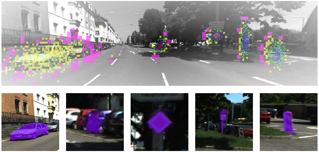

# Looking Locally: Object-Centric Vision Transformers as Foundation Models for Efficient Segmentation 

[](https://arxiv.org/pdf/2502.02763)
[](https://cognitivemodeling.github.io/FLIP/#demo)
[](https://nc.mlcloud.uni-tuebingen.de/index.php/s/FqFzp5LEz8HYtzx)
[](https://nc.mlcloud.uni-tuebingen.de/index.php/s/4CNc5XNc88NWXZK)
[](https://cognitivemodeling.github.io/FLIP)

> We introduce a fovea-like input patching (**FLIP**) approach for object-centric vision that achieves state-of-the-art segmentation performance with orders of magnitude fewer parameters than existing foundation models. Explore the project page at [cognitivemodeling.github.io/FLIP](https://cognitivemodeling.github.io/FLIP).




## 🚀 Interactive Demo

Try FLIP directly in your browser! **[→ Launch Interactive Demo](https://cognitivemodeling.github.io/FLIP/#demo)**

The demo runs FLIP entirely client-side using ONNX Runtime Web. 

## ⚡ Performance

| Model | Parameters | Mean&nbsp;IoU&nbsp;(%) | Inference&nbsp;Time&nbsp;(ms) | Speed-up&nbsp;vs&nbsp;SAM-H |
|-------|-----------:|-----------------------:|-----------------------------:|---------------------------:|
| SAM-H          | 641.1 M | 75.41 | 232.04 | 1.0× |
| SAM-L          | 312.3 M | 75.10 | 148.78 | 1.6× |
| SAM-B          | 93.7 M  | 73.82 | 72.67  | 3.2× |
| FastSAM-s      | 11.8 M  | 44.58 | 9.94   | 23.3× |
| FastSAM-x      | 72.2 M  | 48.04 | 24.32  | 9.5× |
| MobileSAM      | 10.13 M | 71.33 | 21.15  | 11.0× |
| EfficientSAM-T | 10.22 M | 72.29 | 26.75  | 8.7× |
| EfficientSAM-S | 26.41 M | 73.43 | 47.98  | 4.8× |
| **FLIP-Tiny**  | **0.51 M** | **78.24** | **9.82**  | **23.6×** |
| **FLIP-Small** | **2.3 M**  | **79.29** | **12.19** | **19.0×** |
| **FLIP-Middle**| **11.5 M** | **79.93** | **17.54** | **13.2×** |
| **FLIP-Large** | **96.6 M** | **80.33** | **38.65** | **6.0×** |


## 🎯 Key Results

- **Superior Performance**: FLIP-Large achieves **80.33% mean IoU** with only **96.6M parameters**, outperforming SAM-H (75.41% IoU, 641.1M parameters)
- **Extreme Efficiency**: FLIP-Tiny (**0.51M parameters**) outperforms all SAM variants with **78.24% mean IoU** — over **1,257× fewer parameters** than SAM-H
- **Speed**: **23.6× faster** inference than SAM-H while maintaining superior accuracy
- **Scale Invariance**: Robust performance on objects ranging from 0.0001% to 25% of image area


## 🛠️ Installation

```bash
# Clone the repository
git clone https://github.com/CognitiveModeling/FLIP.git
cd FLIP

# Create conda environment
conda env create -f environment.yml
conda activate flip

# Install custom C++ extensions
cd ext
python setup.py build install
cd ..
```

## 📦 Model Checkpoints

Download pre-trained FLIP models:

<!-- TODO: Add actual download links -->
| Model | Parameters | Mean IoU | Checkpoints | ONNX Encoder | ONNX Predictor |
|-------|------------|----------|----------|----------|----------|
| FLIP-Tiny | 0.51M | 78.24% | [Download](https://nc.mlcloud.uni-tuebingen.de/index.php/s/YPdFxPHsTGEkNwz) | [Download](https://manuel-traub.de/onnx/flip-encoder-tiny.onnx) | [Download](https://manuel-traub.de/onnx/flip-predictor-tiny.onnx) |
| FLIP-Small | 2.3M | 79.29% | [Download](https://nc.mlcloud.uni-tuebingen.de/index.php/s/Zj3xDBXrZcSMtoy) | [Download](https://manuel-traub.de/onnx/flip-encoder-small.onnx) | [Download](https://manuel-traub.de/onnx/flip-predictor-small.onnx) |
| FLIP-Middle | 11.5M | 79.93% | [Download](https://nc.mlcloud.uni-tuebingen.de/index.php/s/Cx4kTMbRrD5DCmt) | [Download](https://manuel-traub.de/onnx/flip-encoder-middle.onnx) | [Download](https://manuel-traub.de/onnx/flip-predictor-middle.onnx) |
| FLIP-Large | 96.6M | 80.33% | [Download](https://nc.mlcloud.uni-tuebingen.de/index.php/s/57NXrqrxmzjxzoX) | [Download](https://manuel-traub.de/onnx/flip-encoder-large.onnx) | [Download](https://manuel-traub.de/onnx/flip-predictor-large.onnx) |

## 📊 Datasets

Pre-processed evaluation sets for reproducibility:

- **Hypersim**: [Download](https://nc.mlcloud.uni-tuebingen.de/index.php/s/7RcABXMoXXMqX4t)
- **KITTI-360**: [Download](https://nc.mlcloud.uni-tuebingen.de/index.php/s/5HAGg3DdQa7TWyR)
- **OpenImages**: [Download](https://nc.mlcloud.uni-tuebingen.de/index.php/s/ie2t5BdJeHFHmS9)
- **COCO**: [Download](https://nc.mlcloud.uni-tuebingen.de/index.php/s/8SRpRdPTjq7PRMH)
- **LVIS**: [Download](https://nc.mlcloud.uni-tuebingen.de/index.php/s/FYNnxMjBPDbfYCD)
- **ObjaScale**: [Download](https://nc.mlcloud.uni-tuebingen.de/index.php/s/4CNc5XNc88NWXZK)

## 🔥 Quick Start


### Interactive Demo (Local)

```bash
python -m model.scripts.demo \
    --image path/to/image.jpg \
    --config configs/flip-tiny.json \
    --checkpoint checkpoints/flip-tiny.ckpt
```

### Evaluation

Run evaluation on a dataset:

```bash
python -m model.scripts.evaluate_single_hdf5 \
    --dataset_path path/to/dataset.hdf5 \
    --model_path checkpoints/flip-large.ckpt \
    --config configs/flip-large.json \
    --optimized  # Use 5-sigma bounding box optimization
```


## 🔧 Training

FLIP uses HDF5 datasets for efficient training and evaluation. To train on your own data, you'll need to convert it to the FLIP HDF5 format.

### Converting COCO Format

If your data is in COCO format, use our conversion script:

```bash
python model/scripts/convert_coco_to_hdf5.py \
    --coco_root /path/to/coco/images \
    --annotation_file /path/to/annotations.json \
    --output_dir /path/to/output \
    --split train2017
```

This script:
- Converts COCO polygon and RLE masks to binary masks
- Computes bounding boxes and Gaussian parameters for each instance
- Compresses images and masks for efficient storage
- Creates the HDF5 structure required by FLIP

### HDF5 Dataset Structure

The generated HDF5 files contain:
- `rgb_images`: Compressed JPEG images
- `instance_masks`: Compressed PNG masks  
- `positions`: Gaussian parameters (μₓ, μᵧ, σₓ², σᵧ², σₓᵧ)
- `instance_mask_bboxes`: Bounding boxes for each mask
- `coco_image_ids`, `license_ids`: Metadata for attribution

### Custom Data Conversion

For non-COCO datasets, adapt the conversion script by:
1. Implementing your annotation parser
2. Converting masks to binary format
3. Computing Gaussian parameters using `compute_gaussian_params_from_mask()`
4. Following the HDF5 structure from the COCO converter

### Training Configuration

Update your training config to point to the new HDF5 files:

```json
{
  "data": {
    "train": [{"paths": ["/path/to/your-train-v1.hdf5"]}],
    "val": [{"paths": ["/path/to/your-val-v1.hdf5"]}]
  }
}
```

### Start Training

```bash
python -m model.main --cfg your_config.json
```

For distributed training:
```bash
python -m model.main --cfg your_config.json --num-gpus 4
```

## 🚀 Inference Pipeline

The `inference/` directory provides deployment helpers for FLIP models:

- **ONNX Export**: Convert trained PyTorch models to ONNX format with KV caching optimization
- **WebAssembly Support**: Compile C extensions to WASM for efficient browser-based inference
- **Optimized C Extensions**: High-performance patch sampling and Gaussian operations for faster preprocessing
- **Evaluation Tools**: Comprehensive benchmarking utilities for HDF5 datasets

For detailed setup and usage instructions, see [`inference/README.md`](inference/README.md).


## 📈 Reproducing Paper Results

Download the model checkpoints and evaluation datasets from the links provided above. Create directories `checkpoints/`, `datasets/`, and `results/` to organize your files.

Run evaluation on any model-dataset combination using:

```bash
python -m model.scripts.evaluate_single_hdf5 \
    --dataset_path datasets/COCO/coco_val2017.hdf5 \
    --model_path checkpoints/flip-large.ckpt \
    --config configs/flip-large.json \
    --optimized \
    --output_dir results/flip-large/coco \
```

Results are saved as CSV files with IoU scores and timing information. Use `--optimized` for 5-sigma bounding box optimization or `--hirachical` for the hirachical inference version.

## 📝 Citation

If you find FLIP useful for your research, please cite our paper:

```bibtex
@article{traub2025flip,
  title={Looking Locally: Object-Centric Vision Transformers as Foundation Models for Efficient Segmentation},
  author={Traub, Manuel and Butz, Martin V},
  journal={arXiv preprint arXiv:2502.02763},
  year={2025}
}
```


## 📜 License

This project is licensed under the MIT License - see the [LICENSE](LICENSE) file for details.

## 🙏 Acknowledgments

This work received funding from the Deutsche Forschungsgemeinschaft (DFG, German Research Foundation) under
Germany’s Excellence Strategy – EXC number 2064/1 –Project number 390727645 as well as from the Cyber Valley
in Tübingen, CyVy-RF-2020-15. The authors thank the International Max Planck Research School for Intelligent
Systems (IMPRS-IS) for supporting Manuel Traub, and the Alexander von Humboldt Foundation for supporting Martin Butz
